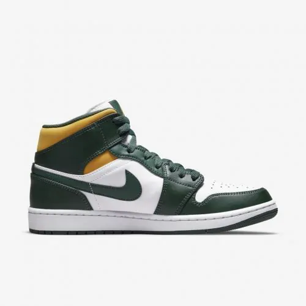

# 🖼️ Carrousel Images

### Pequeno projeto de um carrousel de imagens, onde ao clicar nas imagens menores, ela é exibida no container maior.

### 🔗 de uma olhada no projeto: https://carrousel-images-nf.netlify.app/
#### Caso queira a versão com os botões para trocar as imagens: 

#### 🗒️ HTML:
	
```HTML
<button id="change-image-left">
  <span class="material-icons">arrow_back_ios</span>
</button>

    <main class="container-carrousel">
        <div class="container-image-principal">
            
        </div>    
        <div class="container-mini-images">
            <div class="card-image selected">   
                
            </div>
            <div class="card-image">
                
            </div>
            <div class="card-image">
                
            </div>
            <div class="card-image">
                
            </div>
       </div>
    </main>

<button id="change-image-right">
  <span class="material-icons">arrow_forward_ios</span>
</button>
```

#### 🗒️ JavaScript:

```Javascript

const buttonBack = document.getElementById("change-image-left")
const buttonForward = document.getElementById("change-image-right")

let counter = 1;
 
// Botão de avançar
buttonForward.addEventListener("click", () => {
    cards.map(element => element.classList.remove("selected"))
 
    counter++;
    counter == cards.length + 1 ? counter = 1 : null;
    changeImage(counter - 1);
})
 
// Botão de Retornar
buttonBack.addEventListener("click", () => {
    cards.map(element => element.classList.remove("selected"))
 
    counter--;
    counter == 0 ? counter = cards.length : null;
    changeImage(counter - 1)
})
 
function changeImage(element){
    cards[element].classList.add("selected");
    container_image.innerHTML = `${cards[element].firstElementChild.outerHTML}`
}
```
